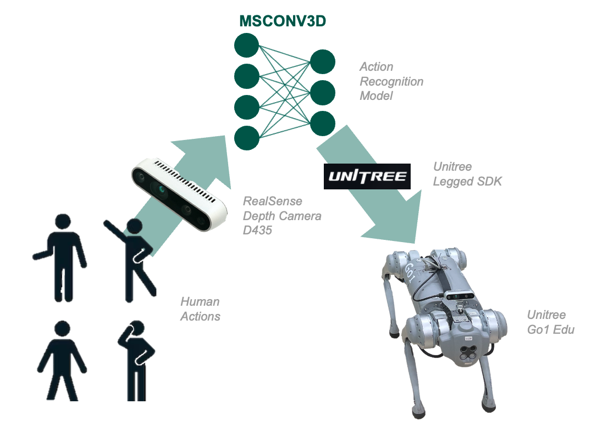
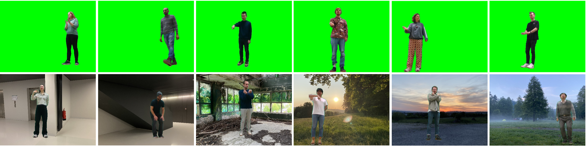

<h1>University of Technology Chemnitz - Human Robot Interaction</h1>
<h2>MSCONV3D and TUC-HRI: A comprehensive framework for Human-Robot Interaction</h2>

_Robert Schulz, Chaitanya Bandi, Ulrike Thomas_

<h2>Table of Contents</h2>

- [1 Introduction](#1-introduction)
- [2 Framework](#2-framework)
  - [2.1 TUC-HRI Dataset](#21-tuc-hri-dataset)
- [3 Installation](#3-installation)
  - [3.1 Requirements](#31-requirements)
  - [3.2 UniTree Legged SDK](#32-unitree-legged-sdk)
  - [3.3 OpenCV](#33-opencv)
  - [3.4 Errors](#34-errors)
- [References](#references)

# 1 Introduction
This repository contains source code is the official implementation of [1]. Please refer to this publication when using parts of this work.

Here, we provide a comprehensive framework to interact with the quadruped robot Unitree Go1 Edu via action gestures performed by a human subject. Therefore, this repository combines the following components to form a fully functional human robot interaction environment:
1. **TUC-HRI**, a novel RGB dataset specifically designed for HRI applications. TUC-HRI features simultaneous multi-view recordings from three depth cameras, providing diverse perspectives to improve model generalization. To ensure consistency and robustness, all backgrounds are completely removed, allowing models to focus solely on human motion.
2. **MSCONV3D**, a multistage 3D convolution-based model that achieves 97.59% accuracy on TUC-HRI for random validation and 88.67% for cross-subject validation, demonstrating its effectiveness for HAR in controlled HRI settings. 
3. Additionally, we introduce a simple yet effective **person re-identification algorithm** for stable tracking in multi-person scenarios.

Together, **TUC-HRI**, **MSCONV3D**, and the **re-identification approach** form a comprehensive framework that advances HAR research, with a strong emphasis on dataset quality and real-world applicability for HRI.

The code and dataset are available at:
- Dataset - TUC-HRI: https://github.com/SchulzR97/TUC-HRI
- HAR Model - MSCONV3D: https://github.com/SchulzR97/MSCONV3D
- Framework - HAR2Unitree **(this)**: https://github.com/SchulzR97/HAR2Unitree

# 2 Framework

_Fig. 1 Illustration of the overall framework._

## 2.1 TUC-HRI Dataset
HuggingFace: https://huggingface.co/datasets/SchulzR97/TUC-HRI

For dataset recording, we used Intel RealSense D435 depth cameras.


_Fig. 2. Sample frames of the TUC-HRI dataset. First row shows samples taken from train split and second row shows samples from validation split._

# 3 Installation
> Please use Python 3.10

## 3.1 Requirements
```bash
pip install -r requirements.txt
```

## 3.2 UniTree Legged SDK
**Clone SDK**
```bash
git clone https://github.com/unitreerobotics/unitree_legged_sdk.git
cd unitree_legged_sdk
```
**Install MessagePack for C++**
```bash
sudo apt-get update
sudo apt-get install libmsgpack-dev
```
**Compile**
```bash
mkdir build && cd build
cmake -DPYTHON_BUILD=TRUE ..
make -j$(nproc)
```

**Rename File**
- Goto `lib/python/amd64`
- Copy `robot_interface.cpython-310-x86_64-linux-gnu.so` and rename it to `robot_interface.so`

**Set path in code**
- Replace the path for `ROBOT_INTERFACE_DIR` at `modules/unitree.py` with the absolute path your `lib/python/amd64` directory

## 3.3 OpenCV
```bash
$ sudo apt-get install python3-opencv
```

## 3.4 Errors
<h3>librealsense2 - Permission denied</h3>

**Error Message:**<br>
- RuntimeError: Failed to open scan_element /sys/devices/pci0000:00/0000:00:14.0/usb4/4-1/4-1:1.5/0003:8086:0B3A.0005/HID-SENSOR-200073.2.auto/iio:device1/scan_elements/in_accel_y_en Last Error: Permission denied

**How to fix this error:**<br>
- Download librealsense udev rules to allow usb device access without having sudo permissions: [https://github.com/IntelRealSense/librealsense/blob/master/config/99-realsense-libusb.rules](https://github.com/IntelRealSense/librealsense/blob/master/config/99-realsense-libusb.rules)
- Go to containing directory (e.g. downloads) and open a new console tab
- Copy the file to appropriate directory
    ```bash
    sudo cp 99-realsense-libusb.rules /etc/udev/rules.d/
    ```
- Reload the udev rules
    ```bash
    sudo udevadm control --reload-rules
    sudo udevadm trigger
    ```

